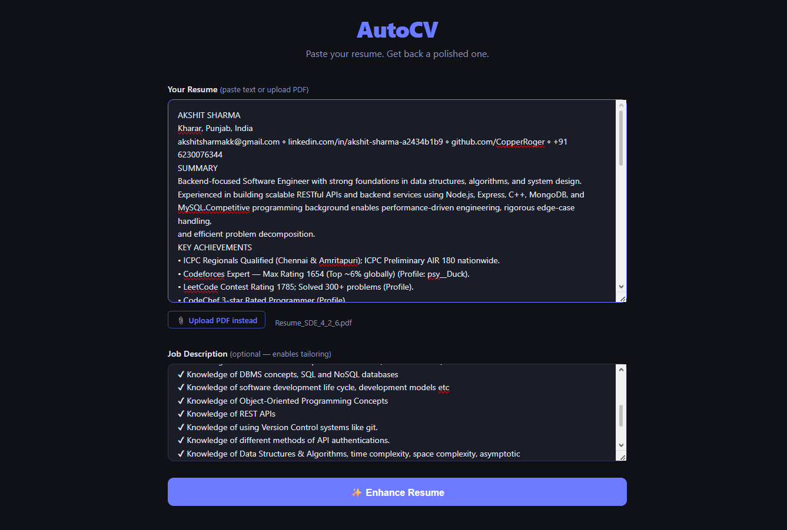
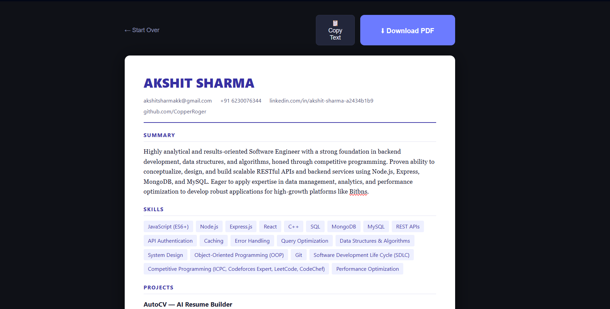
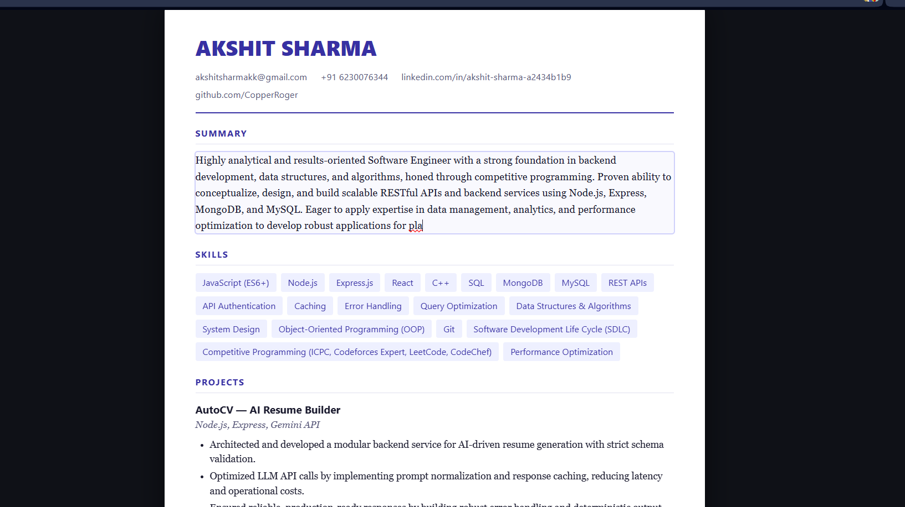

# AutoCV — AI Resume Enhancer

Paste your resume (or upload a PDF) and get back a polished, ATS-friendly version instantly. AutoCV uses Google Gemini to parse your resume, rewrite bullet points with strong action verbs, generate a professional summary, and render everything as a clean editable template.

Optionally paste a job description to tailor the output to a specific role.

---

## Screenshots

### Input


### Generated Resume


### Inline Editing


---

## Features

- **Paste or upload PDF** — works with any resume format
- **AI enhancement** — rewrites bullets, generates summary, quantifies impact
- **JD tailoring** — paste a job description to align keywords and tone
- **Live editable template** — click any field to adjust after generation
- **Download as PDF** — browser print-to-PDF, zero extra dependencies
- **Copy as plain text** — one-click copy for pasting elsewhere

---

## Tech Stack

| Layer | Tech |
|-------|------|
| Backend | Node.js + Express |
| AI | Google Gemini 2.5 Flash |
| PDF parsing | pdf-parse + multer |
| Frontend | Vanilla HTML / CSS / JS |

---

## Local Setup

```bash
git clone https://github.com/CopperRoger/AutoCV.git
cd AutoCV
npm install
cp .env.example .env
# Add your Gemini API key to .env
npm start
```

Open [http://localhost:5000](http://localhost:5000)

### Get a free Gemini API key

1. Go to [aistudio.google.com](https://aistudio.google.com)
2. Click **Get API Key** → **Create API key**
3. Paste it into `.env` as `GEMINI_API_KEY=your_key_here`

---

## Project Structure

```
AutoCV/
├── app.js                 # Express server
├── routes/
│   └── generate.js        # AI processing (text + PDF input)
├── frontend/
│   ├── index.html         # UI
│   ├── style.css          # Styling
│   └── script.js          # Client logic + resume renderer
├── screenshots/           # README screenshots
├── .env.example
└── README.md
```

---

## Environment Variables

| Variable | Description |
|----------|-------------|
| `GEMINI_API_KEY` | Your Google AI Studio API key |
| `PORT` | Server port (default: 5000) |